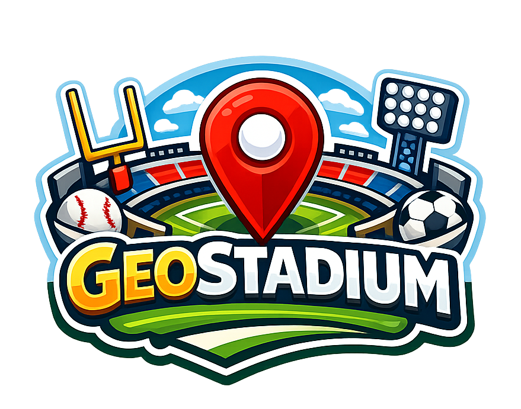

# GeoStadium

A geography guessing game where players identify sports stadiums from satellite imagery. Test your knowledge of MLB ballparks, minor league stadiums, and sports venues from around the world.

**Live Demo:** [geostadium-production.up.railway.app](https://geostadium-production.up.railway.app)



## Features

- **148 stadiums** across MLB, Minor Leagues (AAA, AA, High-A, Low-A), Spring Training, and other sports
- **Satellite imagery** powered by Mapbox GL JS
- **League-based filtering** - Play specific leagues or mix them all
- **Hint system** with score penalties for country, city, capacity, and year opened
- **Distance-based scoring** with perfect zone radius for each stadium
- **Time bonus** for quick guesses
- **Local high scores** stored in browser

## Tech Stack

- **Backend:** Flask (Python)
- **Frontend:** Vanilla HTML/CSS/JavaScript
- **Maps:** Mapbox GL JS (satellite imagery)
- **Data:** JSON file with stadium coordinates and metadata
- **Hosting:** Railway

## Project Structure

```
geostadium/
├── app.py                 # Flask application and routes
├── requirements.txt       # Python dependencies
├── Procfile              # Railway/Heroku process definition
├── runtime.txt           # Python version specification
├── config.json           # Local Mapbox token (not in repo)
├── data/
│   └── stadiums.json     # Stadium database (148 entries)
├── static/
│   ├── css/
│   │   └── style.css     # All styling
│   ├── js/
│   │   ├── game.js       # Game state and flow management
│   │   ├── map.js        # Mapbox integration and markers
│   │   └── scoring.js    # Distance calculation and scoring
│   ├── geostadium_logo.png
│   └── favicon.ico
└── templates/
    ├── base.html         # Base template with Mapbox CSS/JS
    ├── index.html        # Home page with game options
    ├── game.html         # Main game interface
    ├── about.html        # How to play page
    └── results.html      # Game results display
```

## How It Works

### Game Flow

1. Player selects a league and number of rounds on the home page
2. Backend returns a random stadium from the selected league via `/api/stadium/random`
3. Player navigates the satellite map to find the stadium
4. Clicking places a draggable marker for the guess
5. On confirmation, the scoring system calculates points based on distance
6. A line is drawn between the guess and actual location
7. After all rounds, final score is saved to localStorage

### Scoring System

```
Base Score: 5,000 points

Distance Penalty: -1 point per 10 meters from stadium center
Perfect Zone: No penalty if within stadium's radius (120-200m depending on size)
Time Bonus: +500 points if guessed within 30 seconds

Hint Penalties (multiplied against final score):
- Country: -10%
- City: -15%
- Capacity: -10%
- Year Opened: -10%

Final Score = max(0, (Base - Distance + Time Bonus) × Hint Multiplier)
```

### Distance Calculation

Uses the Haversine formula to calculate great-circle distance between two coordinates:

```javascript
calculateDistance(lat1, lng1, lat2, lng2) {
    const R = 6371000; // Earth's radius in meters
    const dLat = toRadians(lat2 - lat1);
    const dLng = toRadians(lng2 - lng1);
    const a = Math.sin(dLat/2)² + cos(lat1) × cos(lat2) × Math.sin(dLng/2)²;
    const c = 2 × atan2(√a, √(1-a));
    return R × c;
}
```

### Map Configuration

- Uses Mapbox `satellite-streets-v12` style
- POI labels (stadiums, hospitals, etc.) are hidden to prevent hints
- Country borders and city names remain visible
- Different leagues start at different zoom levels:
  - MLB/AAA: Zoomed to continental USA
  - AA/High-A/Low-A/Spring: Zoomed to central USA
  - All/Other: World view

### API Endpoints

| Endpoint | Method | Description |
|----------|--------|-------------|
| `/` | GET | Home page |
| `/game` | GET | Game interface |
| `/about` | GET | How to play page |
| `/api/stadium/random` | GET | Get random stadium (supports `league` and `exclude` params) |
| `/api/stadiums` | GET | Get all stadiums |

### Stadium Data Format

```json
{
  "id": "mlb_001",
  "name": "Yankee Stadium",
  "team": "New York Yankees",
  "sport": "baseball",
  "league": "MLB",
  "level": "major",
  "coordinates": { "lat": 40.8296, "lng": -73.9262 },
  "radius": 180,
  "hints": {
    "city": "Bronx, New York",
    "country": "United States",
    "capacity": 46537,
    "opened": 2009
  }
}
```

## Local Development

### Prerequisites

- Python 3.11+
- Mapbox account (free tier works)

### Setup

```bash
# Clone the repository
git clone https://github.com/Thakkennes/geostadium.git
cd geostadium

# Create virtual environment
python3 -m venv venv
source venv/bin/activate

# Install dependencies
pip install -r requirements.txt

# Add your Mapbox token
echo '{"mapbox_token": "your_token_here"}' > config.json

# Run the development server
python app.py
```

Visit `http://localhost:5000` to play locally.

### Environment Variables

For production, set `MAPBOX_TOKEN` as an environment variable instead of using `config.json`.

## Deployment

The project is configured for Railway deployment:

1. Push to GitHub
2. Connect repository to Railway
3. Add `MAPBOX_TOKEN` environment variable
4. Railway auto-detects Python and deploys

## License

MIT

## Credits

- Satellite imagery by [Mapbox](https://www.mapbox.com/)
- Stadium data manually curated
- Built with [Claude Code](https://claude.ai/code)
